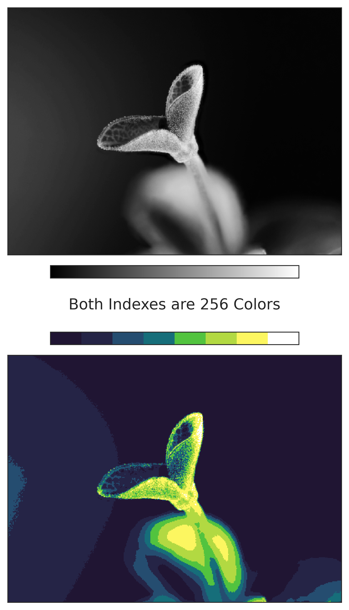
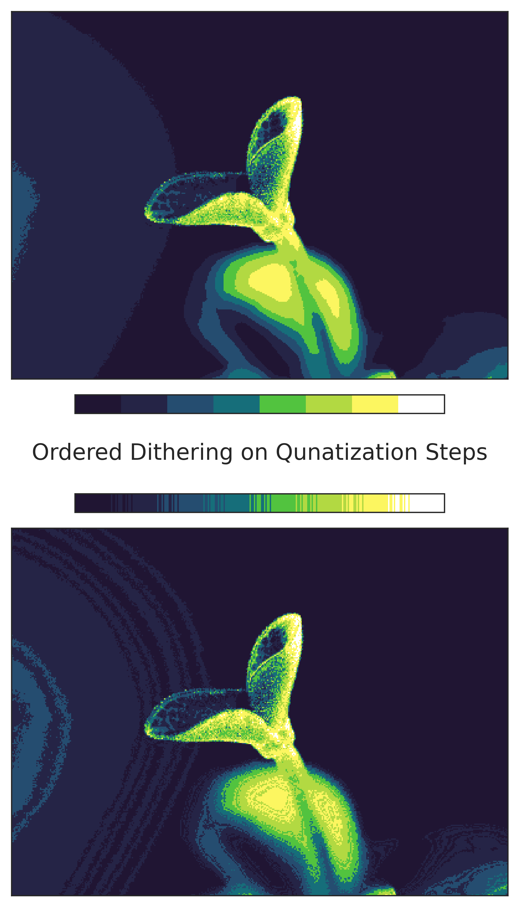
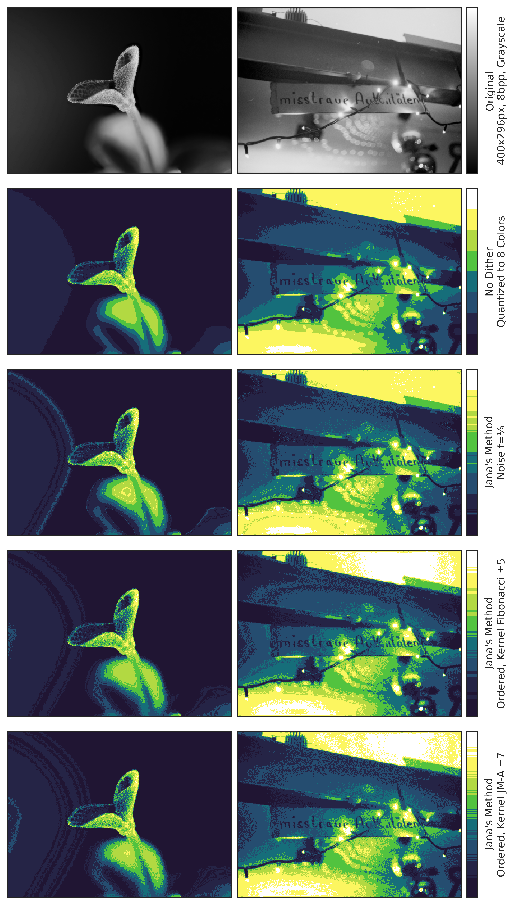

# InDi

Faced with the problem of running a dithering algorythm on a limited hardware, an ESP32, I set out to find a new approach that does not involve iterating pixels. This is my finding and solution, **In**dex-**Di**thering.

### A pixel camera

To set the scope, here is the initial problem and basic idea.
Pixel-Art is usually defined by a lower resolution, both spatial and in colorspace, meaning that an image may only contain 2-32 colors, more are of course possible. This is usually archived by utilizing a colorspace/mode called indexing with an 8 bit index. Each pixels value then does not directly correspond to a grayscale-color, but points to a color on a provided palette. A picture format supporting this is PNG, an images mode can be set to 'indexed' and an 8 bit color palette must be supplied in its header. Here an index with a width of 1, 2, 4 and 8 bit can be chosen.
Now, what if we want to build a [Pixel-Art-Camera](https://github.com/Jana-Marie/Picsy)? This is what I want to archive and PNG and its indexed color-mode allow me to take a few shortcuts. I decided on using an ESP32 as MCU (240MHz, Dual Core, Xtensa, a few MB of RAM) and an OV2640 as image sensor. The OV2640 has a native resolution of 1600x1200px@10bit, which of course is too much in all dimensions for pixel-art.We can scale down the image to 400x296px in sensor, with that already get a suitable resolution and have much less data to worry about. As color-depth we have 10bit, 8bit, RGB565, RGB555 and Grayscale as an option, now there is an opportunity! What if we take the 400x296px image, set the colormode in camera to grayscale and literally write the resulting image into a PNG and supply a color index that only has 8 colors? We must get pixel art, right? Right!

### PNG

This actually works, there are a few caviats though. For once, PNG is a tiny bit involved, it's headers and the pixel data is checksummed, in addition the raw pixel data has to be deflated. This is straightforward to implement though. In addition, our grayscale image as a bitdepth of 8 bit per pixel, hence our index must also be 8 bit long, 256 colors. This is where the real 'magic' starts to take place though. We can simply expand our color-palette, 8 colors, to map onto the 256 color index. We can repeat the first color 32 times, followed by 32 instances of the second color and so forth. We only have to do this once and keep the 256 color palette, we can pre-render it basically. This allows for instantaneous color remapping from a real photo to pixel-art. Furthermore, our extensive index allows for non-linear remapping. Our first color could only appear for the first 8 instances of the index, followed by 16 instances of the second color and so forth. Since our pixel-array is still 8 bit, no information is lost and the image can be remapped at all times.

Drawbacks are of course, that we need to have a greyscale image as input, that only a luminance-remap is possible (not RGB matching) and that the resulting image format must provide an indexed color-space (e.g. PNG, GIF, TIFF).

We now have a color-index image that already looks very much like pixel art, however it can be a bit bleak or ruff at times due to it's limited colors and harsh color-transitions (quantization error). This is usually fixed in computer-graphics or newspaper printing by dithering the image, randomizing quantization error. Countless methods have been developed to solve this problem with varying degrees of success, speed and or aesthetics. Most, if not all of them, however, need to iterate over the pixel array. This is very much not in the spirit of this project, we managed to create a color-quantized image without iterating over the image (almost, deflate still needs to do that) and we want to have dithering... as a treat.

### So, what to do?

I pondered this issue for a few days until a funky solution came to me. You see, while our index is color quantized, our raw data, selecting a color from the index, is not. It contains a lot of information that we are basically throwing out. Furthermore it already contains information about the fringes of our quantization steps, we can use that. Instead of dithering the image, the pixels, we can **dither the index**! It's just an array of 256 triplets that we have to build anyways, which can stay static afterwards. We can pre-compute a dither in form of a dithered index. Pixels close to a color-step of the index then may become a different color than they ought to do.

Lets return to traditional dithering methods. Given that we now have a 1D array that we need to dither, we can actually choose from other algorythms. I chose to implement the simplest one, random noise dithering and an ordered one. Although, I am not sure if that one has a name, it just came to my mind like that.

In the **random-dithering** scenario, each part of the index has a given chance of returning either the next color-step in line, or the previous one. It literally just adds some noise to the image in form of neighbouring colors. The result is very even, although... noisy.

As for the **ordered-dithering**, I wrote a kernel that, at each color-quantization-step chooses n pixels before the step to switch to the next color and n pixels following to choose the latter color. This creates fringy edges due to pixel-noise. The cleaner the image is, the more banding occurs. You can see this in action with the flower-pedal-background. A good kernel can reduce this, I carefully crafted one that is appealing to me and added the Fibonacci series as comparison, both work, check the results!

All in all, this works surprisingly well, more of the image may be ditherd depending on the kernel size.

### Results

### License

Images are CC BY-SA 4.0 by Jana M. Hemsing

Code is GNU GPLv3 

---

Uhm, enjoy?

I would love to know whether this is actually something new or whether this has a name already. Please let me know if you know more about this!